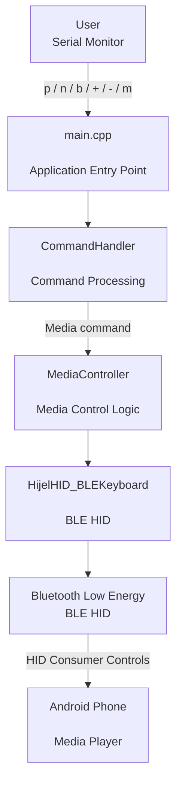
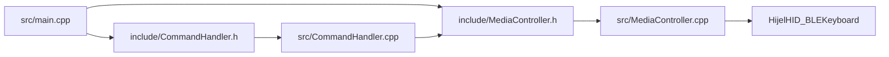

# ESP32 BLE Media Controller

A Bluetooth Low Energy (BLE) HID media controller built using an **ESP32-WROOM-32**.

The project allows an Android phone to be controlled wirelessly using BLE media-control commands. No external buttons, sensors, or additional hardware are required.

The current implementation uses the **Serial Monitor as the command input** and sends the corresponding media-control HID command from the ESP32 to the connected phone.

---

## Features

- Play / Pause
- Next Track
- Previous Track
- Volume Up
- Volume Down
- Mute
- BLE HID communication
- Android phone control
- Serial command interface
- Modular C++ architecture
- PlatformIO build system
- No external sensors required
- No physical buttons required

---

# Hardware Requirements

### Required

- ESP32-WROOM-32 development board
- USB cable
- Android phone

### No external hardware required

This project does **not** require:

- Push buttons
- Sensors
- Potentiometers
- OLED/LCD displays
- External modules

The ESP32 itself handles the BLE HID functionality.

---

# Software Requirements

- Visual Studio Code
- PlatformIO
- Arduino Framework
- ESP32 platform
- NimBLE-Arduino
- HijelHID_BLEKeyboard

### Current library versions

```text
PlatformIO
Espressif 32
Arduino Framework
NimBLE-Arduino 2.5.1
HijelHID_BLEKeyboard 0.5.0
```

---

# Project Architecture

The ESP32 works as a BLE HID media controller.

The user enters a command through the Serial Monitor. The command is processed by the `CommandHandler`, passed to the `MediaController`, and finally sent to the Android phone through BLE HID.



### System Flow

```text
User
  |
  | p / n / b / + / - / m
  v
main.cpp
  |
  v
CommandHandler
  |
  | Media command
  v
MediaController
  |
  v
HijelHID_BLEKeyboard
  |
  v
BLE HID
  |
  v
Android Phone
```

---

# Software Architecture

The project separates the application into different C++ components.



### Responsibilities

| Component | Responsibility |
|---|---|
| `main.cpp` | Application entry point and initialization |
| `CommandHandler` | Reads and processes user commands |
| `MediaController` | Provides media-control operations |
| `HijelHID_BLEKeyboard` | Provides BLE HID functionality |
| ESP32 BLE | Sends HID commands to the phone |
| Android Phone | Receives media-control events |

---

# Project Structure

```text
BLE_Control/
│
├── include/
│   ├── MediaController.h
│   └── CommandHandler.h
│
├── src/
│   ├── main.cpp
│   ├── MediaController.cpp
│   └── CommandHandler.cpp
│
├── lib/
│   └── HijelHID_BLEKeyboard/
│
├── platformio.ini
│
├── README.md
│
└── .gitignore
```

---

# How It Works

The ESP32 acts as a BLE HID consumer-control device.

The Serial Monitor is used as the input interface.

For example:

```text
+
```

The command travels through the application:

```text
Serial Monitor
      |
      v
CommandHandler
      |
      v
MediaController
      |
      v
HID Media Command
      |
      v
BLE
      |
      v
Android Phone
```

For the volume-up command:

```cpp
mediaController.volumeUp();
```

The `MediaController` sends:

```cpp
bleKeyboard.tap(MEDIA_VOLUME_UP);
```

The Android phone receives the event as a standard media-control action.

---

# Supported Commands

| Command | Function |
|---|---|
| `p` | Play / Pause |
| `n` | Next Track |
| `b` | Previous Track |
| `+` | Volume Up |
| `-` | Volume Down |
| `m` | Mute |

---

# Example Serial Monitor

After starting the ESP32 and connecting the phone, the Serial Monitor displays:

```text
=================================
   ESP32 BLE Media Controller
=================================
BLE started!
Connect phone to: ESP32 Media Controller
```

After the phone connects:

```text
====== MEDIA CONTROLLER ======
p = Play/Pause
n = Next Track
b = Previous Track
+ = Volume Up
- = Volume Down
m = Mute
==============================
```

---

# Command Examples

## Play / Pause

Enter:

```text
p
```

Output:

```text
Sending PLAY/PAUSE
```

---

## Next Track

Enter:

```text
n
```

Output:

```text
Sending NEXT TRACK
```

---

## Previous Track

Enter:

```text
b
```

Output:

```text
Sending PREVIOUS TRACK
```

---

## Volume Up

Enter:

```text
+
```

Output:

```text
Sending VOLUME UP
```

---

## Volume Down

Enter:

```text
-
```

Output:

```text
Sending VOLUME DOWN
```

---

## Mute

Enter:

```text
m
```

Output:

```text
Sending MUTE
```

---

# Setup

## 1. Clone the Repository

```bash
git clone https://github.com/<YOUR_USERNAME>/ESP32-BLE-Media-Controller.git
```

Move into the project:

```bash
cd ESP32-BLE-Media-Controller
```

---

# 2. Open the Project in VS Code

Open the project folder using:

```text
Visual Studio Code
```

Install the **PlatformIO IDE** extension if it is not already installed.

---

# 3. Connect the ESP32

Connect the ESP32-WROOM-32 to your computer using USB.

Windows should detect the ESP32 as a COM port.

Example:

```text
COM7
```

The actual COM port may be different.

---

# 4. Build the Project

In PlatformIO:

```text
Project Tasks
    |
    +-- esp32dev
          |
          +-- General
                |
                +-- Build
```

Or use the PlatformIO build button.

A successful build should display:

```text
========================= [SUCCESS] =========================
```

---

# 5. Upload the Firmware

Connect the ESP32 to the computer.

Then select:

```text
Project Tasks
    |
    +-- esp32dev
          |
          +-- General
                |
                +-- Upload
```

Wait until PlatformIO reports:

```text
========================= [SUCCESS] =========================
```

---

# 6. Open Serial Monitor

Open:

```text
PlatformIO
    |
    +-- Project Tasks
          |
          +-- esp32dev
                |
                +-- Monitor
```

The configured baud rate is:

```text
115200
```

This is configured in `platformio.ini`:

```ini
monitor_speed = 115200
```

---

# Connecting the Phone

On the Android phone:

```text
Settings
    |
    +-- Bluetooth
```

Find:

```text
ESP32 Media Controller
```

Connect to it.

Once connected, the ESP32 can send BLE HID media commands to the phone.

---

# Testing

Start playing music or video on the Android phone.

Then use the Serial Monitor.

Test each command individually.

```text
p
```

Play / Pause

```text
n
```

Next Track

```text
b
```

Previous Track

```text
+
```

Volume Up

```text
-
```

Volume Down

```text
m
```

Mute

---

# C++ Design

The project uses a modular C++ design where each class has a specific responsibility.

---

## MediaController

Files:

```text
include/MediaController.h
src/MediaController.cpp
```

`MediaController` provides the media-control interface.

Example:

```cpp
void MediaController::volumeUp()
{
    bleKeyboard.tap(MEDIA_VOLUME_UP);
}
```

Available operations:

```cpp
playPause()
nextTrack()
previousTrack()
volumeUp()
volumeDown()
mute()
```

It also provides the BLE connection state:

```cpp
bool isConnected();
```

---

# CommandHandler

Files:

```text
include/CommandHandler.h
src/CommandHandler.cpp
```

`CommandHandler` is responsible for processing commands received from the Serial Monitor.

Example:

```cpp
case 'p':
    Serial.println("Sending PLAY/PAUSE");
    mediaController.playPause();
    break;
```

This keeps command processing separate from the BLE HID implementation.

---

# main.cpp

File:

```text
src/main.cpp
```

`main.cpp` is responsible for:

- Starting Serial communication
- Creating the BLE HID object
- Starting BLE
- Creating `MediaController`
- Creating `CommandHandler`
- Checking BLE connection
- Reading Serial input
- Passing commands to `CommandHandler`

The main application flow is:

```cpp
CommandHandler commandHandler(mediaController);
```

Then:

```cpp
commandHandler.processCommand(command);
```

---

# BLE Communication

The ESP32 acts as a BLE HID device.

The HID consumer-control commands include:

```text
MEDIA_PLAY_PAUSE
MEDIA_NEXT_TRACK
MEDIA_PREV_TRACK
MEDIA_VOLUME_UP
MEDIA_VOLUME_DOWN
MEDIA_MUTE
```

These commands are transmitted over:

```text
ESP32
  |
  v
Bluetooth Low Energy
  |
  v
Android HID
  |
  v
Media / Volume Control
```

---

# Memory Usage

Example build result for the current project:

```text
RAM:
11.1% used

Flash:
46.7% used
```

Example:

```text
RAM:
36,396 bytes / 327,680 bytes

Flash:
612,649 bytes / 1,310,720 bytes
```

Memory usage can change depending on the library versions and project configuration.

---

# Troubleshooting

## ESP32 does not appear in Bluetooth

Try:

1. Reset the ESP32.
2. Turn Bluetooth off and on on the phone.
3. Remove the previous `ESP32 Media Controller` pairing.
4. Restart the ESP32.
5. Pair again.

---

# Upload Error: COM Port Busy

You may see:

```text
Could not open COM7
The port is busy or doesn't exist.
```

Close applications that may be using the ESP32 serial port:

- PlatformIO Serial Monitor
- Arduino Serial Monitor
- Arduino IDE
- PuTTY
- Tera Term
- Other serial terminal applications

Then disconnect and reconnect the ESP32 and try uploading again.

---

# Upload Error: Wrong COM Port

Check:

```text
Windows Device Manager
    |
    +-- Ports (COM & LPT)
```

Find the COM port assigned to the ESP32.

For example:

```text
USB-SERIAL CH340 (COM7)
```

If required, configure the port in `platformio.ini`:

```ini
upload_port = COM7
```

Replace `COM7` with the actual port assigned to your ESP32.

---

# Media Command Does Not Work

Check:

1. The phone is connected to `ESP32 Media Controller`.
2. The media application is playing.
3. Serial Monitor is configured for `115200`.
4. The correct command is entered.
5. The ESP32 shows that the BLE connection is active.

For example:

```text
Sending VOLUME UP
```

should appear when entering:

```text
+
```

---

# Design Principles Demonstrated

This project demonstrates several embedded C++ concepts:

- C++ classes
- Header/source separation
- Encapsulation
- Constructors
- Object references
- Composition
- Separation of concerns
- Modular design
- Embedded software architecture
- BLE HID communication
- Serial communication
- PlatformIO project organization

---

# Future Improvements

The current version intentionally uses the Serial Monitor as the command interface.

Possible future improvements include:

- Physical buttons
- Touch controls
- Rotary encoder
- OLED display
- Battery monitoring
- BLE connection-status indicator
- Automatic BLE reconnection
- Dedicated command-line interface
- Configuration menu
- Multiple BLE profiles
- `BleManager` class
- Unit testing
- Logging framework

These features are planned improvements and are not part of the current implementation.

---

# Why This Project?

This project was created to explore:

```text
Embedded C++
      +
ESP32
      +
Bluetooth Low Energy
      +
BLE HID
      +
Object-Oriented Design
      +
PlatformIO
```

It provides a small practical example of separating embedded application logic into reusable C++ components.

---

# Technology Stack

```text
Language:
C++

Microcontroller:
ESP32-WROOM-32

Framework:
Arduino

Build System:
PlatformIO

Wireless:
Bluetooth Low Energy

Protocol:
BLE HID

BLE Library:
NimBLE-Arduino

HID Library:
HijelHID_BLEKeyboard

Target Device:
Android Phone
```

---

# Project Status

```text
Status: Working

Hardware:
ESP32-WROOM-32

BLE:
Working

BLE HID:
Working

Android Connection:
Working

Play/Pause:
Working

Next Track:
Working

Previous Track:
Working

Volume Up:
Working

Volume Down:
Working

Mute:
Working

PlatformIO Build:
Working

PlatformIO Upload:
Working
```

---

# License

This project is licensed under the MIT License.
See the [LICENSE](LICENSE) file for details.

---

# Author

**Hariharathmajan R K**

Embedded C++ | ESP32 | BLE | Android | PlatformIO

---

# Acknowledgements

This project uses:

- ESP32 Arduino framework
- NimBLE-Arduino
- HijelHID_BLEKeyboard
- PlatformIO
